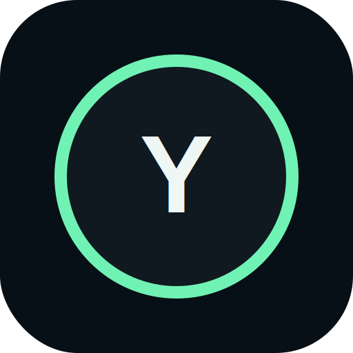

<!-- prettier-ignore -->
<div align="center">



# YUEDMAI Next

*Camera-first stretch quests for kiosk screens and phone controllers.*


[Overview](#overview) • [Features](#features) • [Get started](#get-started) • [How it works](#how-it-works) • [API](#api) • [Roadmap](#roadmap)

</div>

YUEDMAI Next is a server-hosted, gamified stretching companion. A display device opens a kiosk screen, creates a short-lived room, and shows a QR code. A user scans the code with a phone, joins as a guest, selects a stretch quest, and controls the live session while the display handles camera tracking, calibration, feedback, score, XP, stars, and completion results.

> [!NOTE]
> This is an active prototype. Rooms, sessions, quests, and scores are currently stored in memory, so state resets when the backend restarts. Authentication, database persistence, production push notifications, and deployment infrastructure are intentionally out of scope for the current product path.

## Overview

YUEDMAI Next is designed as a two-screen stretch booth:

```text
Display screen
  Kiosk QR code, camera preview, calibration, pose overlay, live feedback, rewards

Phone controller
  Join flow, guest mode, routine selection, start, pause, resume, next, end

FastAPI backend
  Room pairing, WebSocket state sync, session engine, scoring, quests, notifications
```

The main product direction is camera-first and web/PWA-first. Optional Arduino, Nano BLE, serial, and wearable integrations should stay outside the main path unless they are added later through a narrow adapter.

## Features

- **Two-screen room pairing**: create a kiosk room, scan a QR code, and control the display from a phone.
- **Guest controller flow**: join quickly without accounts while keeping room codes temporary.
- **Stretch quest routines**: choose between `Quick Reset` and `Meme Mode` starter routines.
- **Live camera experience**: browser camera preview, MediaPipe pose landmarks, skeleton overlay, and calibration cues.
- **Game loop**: score, stars, XP, session progress, skipped stretches, completion screen, and daily quest stubs.
- **Realtime sync**: display and controller stay updated through room WebSockets.
- **PWA starter**: manifest, SVG icon, and service worker cache shell.
- **Backend test coverage**: API and service tests for room flows, commands, scoring, and WebSockets.

> [!IMPORTANT]
> YUEDMAI rewards consistency, completion, safe visibility, and calm practice. It should not score body shape, body size, attractiveness, or extreme flexibility.

## Project structure

```text
.
├── backend/
│   ├── app/
│   │   ├── api/             FastAPI routes for rooms, sessions, quests, notifications, pose
│   │   ├── core/            Runtime configuration
│   │   ├── models/          Domain and room models
│   │   └── services/        In-memory room, session, scoring, quest, notification, pose services
│   ├── tests/               Backend API and service tests
│   └── requirements.txt
├── frontend/
│   ├── public/              PWA manifest, service worker, project icon
│   ├── src/
│   │   ├── pages/           Kiosk, phone join, phone controller, completion screens
│   │   ├── api.js           REST and WebSocket client
│   │   ├── pose-landmarker.ts
│   │   └── stretch-evaluator.ts
│   └── package.json
└── docs/                    Architecture notes, migration plan, feature specs
```

## Get started

### Prerequisites

- Python 3 with `venv`
- Node.js LTS and npm
- A browser with camera access

Camera access works on `localhost` during development. For real devices outside localhost, use HTTPS or browser-supported secure origins.

### 1. Start the backend

```bash
cd backend
python -m venv .venv
source .venv/bin/activate
python -m pip install --upgrade pip
pip install -r requirements.txt
uvicorn app.main:app --reload --host 0.0.0.0 --port 8000
```

The API will be available at `http://localhost:8000`.

### 2. Start the frontend

Open a second terminal:

```bash
cd frontend
npm install
npm run dev
```

The Vite app will be available at `http://localhost:5173`.

### 3. Try the two-screen flow

1. Open `http://localhost:5173/display` on the display device.
2. Scan the QR code with a phone, or use the **Simulate phone scan** link during development.
3. Continue as guest.
4. Choose a routine.
5. Tap **Show Camera** or **Start Quest** from the phone controller.
6. Move in front of the display camera and follow the live feedback.

> [!TIP]
> For testing with a real phone, open the display through your computer's LAN IP instead of `localhost`, for example `http://192.168.1.20:5173/display`. Set `VITE_API_BASE=http://192.168.1.20:8000` before starting the frontend so the phone can reach the backend too.

## Configuration

### Backend

Create `backend/.env` from `backend/.env.example` if you need local overrides.

| Variable | Default | Purpose |
| --- | --- | --- |
| `APP_NAME` | `YUEDMAI Next` | FastAPI app name |
| `APP_ENV` | `development` | Runtime environment label |
| `FRONTEND_ORIGIN` | `http://localhost:5173` | Frontend origin for local development |
| `POSE_BACKEND` | `mock` | Placeholder for future pose backend selection |
| `DATABASE_URL` | `sqlite:///./yuedmai.db` | Reserved for future persistence |
| `ROOM_TTL_SECONDS` | `600` | Room lifetime before a non-started room expires |

### Frontend

| Variable | Default | Purpose |
| --- | --- | --- |
| `VITE_API_BASE` | `http://localhost:8000` in dev, current origin in built app | Backend REST and WebSocket base URL |
| `VITE_MEDIAPIPE_WASM_ROOT` | jsDelivr MediaPipe WASM URL | Override MediaPipe WASM loading path |
| `VITE_POSE_LANDMARKER_MODEL` | Google-hosted pose landmarker model | Override pose model URL |

## Build and serve as one app

The backend serves `frontend/dist` as a single-page app when that folder exists.

```bash
cd frontend
npm install
npm run build

cd ../backend
source .venv/bin/activate
uvicorn app.main:app --host 0.0.0.0 --port 8000
```

Then open `http://localhost:8000`.

## How it works

```text
1. Display opens /display
2. Backend creates a short room code through POST /api/rooms
3. Display renders a QR code for /join/:roomCode
4. Phone joins through POST /api/rooms/:roomCode/join
5. Controller selects a routine and sends room commands
6. Display and phone receive room updates over WebSockets
7. Display runs camera and pose analysis in the browser
8. Backend scores the active session and returns XP, stars, and feedback tags
9. Completion screen summarizes rewards and waits for another quest
```

The browser currently runs the active pose landmarking path with MediaPipe Tasks Vision. The backend still includes a mock `/ws/pose-stream` endpoint as a starter contract and future replacement point.

## API

### Room flow

| Method | Path | Description |
| --- | --- | --- |
| `POST` | `/api/rooms` | Create a temporary room code |
| `GET` | `/api/rooms/{room_code}` | Load room state |
| `GET` | `/api/rooms/routines` | List available routines |
| `POST` | `/api/rooms/{room_code}/join` | Join a room as a guest controller |
| `POST` | `/api/rooms/{room_code}/routine` | Select a routine |
| `POST` | `/api/rooms/{room_code}/commands` | Send controller commands |
| `WS` | `/ws/rooms/{room_code}/display` | Subscribe as display |
| `WS` | `/ws/rooms/{room_code}/controller` | Subscribe as phone controller |

Supported room commands:

```text
START_CALIBRATION
START_SESSION
BEGIN_ACTIVE_SESSION
PAUSE_SESSION
RESUME_SESSION
NEXT_STRETCH
SKIP_STRETCH
END_SESSION
START_ANOTHER_QUEST
```

### Session, quest, and helper endpoints

| Method | Path | Description |
| --- | --- | --- |
| `POST` | `/api/sessions` | Create a standalone stretch session |
| `GET` | `/api/sessions/{session_id}` | Load a session |
| `POST` | `/api/sessions/{session_id}/score` | Score the current stretch from a pose signal |
| `POST` | `/api/sessions/{session_id}/advance` | Advance to the next stretch or complete the session |
| `GET` | `/api/quests/daily` | Return demo daily quests |
| `GET` | `/api/notifications/preview` | Return a reminder preview |
| `WS` | `/ws/pose-stream` | Mock pose stream contract |

## Testing

Backend tests exist for room APIs, room service behavior, session scoring, and WebSocket updates.

```bash
cd backend
python -m pytest
```

The frontend package currently does not define a test script.

## Troubleshooting

### The phone opens the QR link but cannot connect

Make sure the QR code points to a URL your phone can reach. Avoid opening the display at `localhost` when using a separate phone. Use the computer's LAN IP and set `VITE_API_BASE` to the same backend host.

### The camera does not start

Grant camera permission in the browser. Camera APIs usually work on `localhost` during development, but deployed or LAN-hosted camera flows should use HTTPS.

### The room expired

Rooms expire before a session starts. Refresh the display to create a new room code.

### The app loses state after backend restart

That is expected in the current prototype. Room, session, and quest state are in memory until persistence is added.

## Roadmap

- Replace temporary in-memory services with database-backed persistence.
- Add real accounts for saved XP, streaks, badges, and notification preferences.
- Move production reminders to service worker push subscriptions plus a scheduled backend job.
- Decide whether final pose inference stays browser-side, moves server-side, or uses a hybrid landmark contract.
- Add deployment configuration once the local two-screen experience stabilizes.

For deeper design notes, see [`docs/ARCHITECTURE.md`](./docs/ARCHITECTURE.md), [`docs/MIGRATION_PLAN.md`](./docs/MIGRATION_PLAN.md), and [`docs/specs/two-screen-qr-controller.md`](./docs/specs/two-screen-qr-controller.md).
